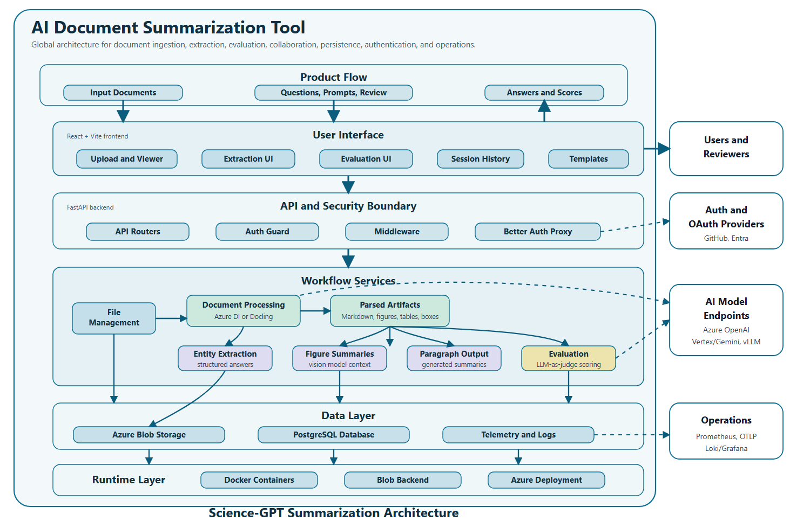

# AI Document Summarization Tool 🚀

A full-stack platform for document ingestion, multimodal extraction, prompt-driven workflows, and in-app evaluation.

Built with a React frontend, FastAPI backend, Better Auth sidecar, PostgreSQL, and a flexible AI model layer that can be adapted to multiple providers and deployment environments.

---

## ✨ At a glance

This platform is designed for teams that need to ingest documents, extract structured information, analyze figures, run prompt-based workflows, and evaluate output quality in one place.

It supports:

- **Containerized local development and deployment** across frontend, backend, auth, and supporting services
- **Document processing pipelines** with parser options such as **Azure Document Intelligence** and **Docling**
- **Pluggable model providers** including:
  - Azure OpenAI
  - Google Vertex AI / Gemini
  - Ollama
  - vLLM-backed endpoints
  - other provider-specific or self-hosted runtimes
- **Prompt-based entity extraction** and structured downstream workflows
- **Template workspaces** for creating, organizing, versioning, and sharing prompts
- **User groups and shared workspaces** for collaborative review and reuse
- **Improved authentication** through Better Auth with GitHub OAuth and Microsoft Entra support
- **In-app evaluation workflows** powered by **DeepEval**, including custom evaluation steps and LLM-as-a-judge patterns
- **Batch and interactive workflows** for extraction, review, and evaluation
- **Production-oriented deployment paths** for Azure infrastructure and other containerized environments

---

## 🏗 Architecture overview

### Global system architecture



*Architecture overview. The platform connects document ingestion, the React user interface, FastAPI orchestration, parser outputs, LLM workflows, evaluation, collaboration, persistence, authentication, and observability.*

Detailed backend diagrams: [Backend visual workflow map](docs/backend/README.md).

The application is organized around a small set of core services:

| Service | Port | Purpose |
| --- | ---: | --- |
| Frontend (React + Vite) | 3000 | Main user interface |
| Backend (FastAPI) | 8001 | Document processing, extraction, evaluation, and APIs |
| Auth sidecar (Better Auth) | 3001 | Authentication, session handling, and OAuth flows |
| PostgreSQL | 5432 | Application data, auth tables, sessions, templates, and groups |
| Azurite (local dev) | 10000 | Local Azure Blob Storage emulator |

In production, the frontend can be deployed separately while the backend and auth service run together in a containerized environment.

---

## 🖼 Product walkthrough

> The screenshots below are sourced from `docs/images/`.

### Overall application flow


*Figure 1. High-level application flow showing document ingestion, extraction, prompt-driven workflows, review, and in-app evaluation.*

### Multi-document upload and parser selection


*Figure 2. Document upload workflow showing support for multiple document ingestion and parser selection through the document parser dropdown.*

### Figure extraction and detailed vision analysis


*Figure 3. Expanded figure extraction view with detailed figure analysis and summarization generated by vision large language models (VLLMs).* 

### LLM selection for entity extraction


*Figure 4. Entity extraction workflow showing model selection for the extraction step.*

### Entity extraction results and visual grounding


*Figure 5. Entity extraction page showing the entity name, prompt used for extraction, extracted value, and visual grounding with a bounding box drawn around the cited region in the PDF.*

### In-app evaluation setup


*Figure 6. In-app evaluation page where users can enter ground truth and use LLM-as-a-judge workflows to score multiple outputs.*

### In-app evaluation results and export


*Figure 7. Evaluation results page with a tabular view of scoring outputs and export options for Excel-compatible batch output.*

### Session metrics tracked in app


*Figure 8. Additional in-app metrics view showing session-level tracking and performance insights captured during workflow execution.*

---

## 🔑 Core capabilities

### 1. Container-first development and deployment

The stack is designed to run in containers for both local development and deployment. The repository already includes Docker support for:

- frontend
- backend
- auth service
- PostgreSQL
- local blob storage emulation

This makes it easier to maintain consistent environments across local development, CI/CD, and cloud deployments.

### 2. Flexible model and provider integration

The application is built so model access is not tied to a single vendor.

The platform is designed to support providers and runtimes such as:

- **Azure OpenAI**
- **Vertex AI / Gemini**
- **Anthropic-style providers**
- **Local or self-hosted runtimes** such as **Ollama** and **vLLM**

This makes it easier to swap providers based on cost, privacy, performance, or deployment constraints.

### 3. Better Auth and session handling

Authentication is handled by a dedicated **Better Auth** sidecar backed by PostgreSQL.

This provides:

- GitHub OAuth support
- Microsoft Entra support
- server-side session validation
- clearer separation between application data and auth concerns
- a more portable architecture for self-managed deployments

### 4. Groups, sharing, and collaborative workflows

The platform includes collaboration features for teams:

- create and manage **user groups**
- share sessions with groups
- browse **shared history**
- open shared work in a safe copy-on-write workflow

### 5. Template workspace

Prompt engineering is a first-class part of the product.

The template workspace supports:

- creating and editing prompt templates
- organizing templates into folders and workspaces
- user, group, and global scope
- sharing templates with collaborators
- template version history and iteration

### 6. In-app evaluation with DeepEval

The app includes built-in evaluation workflows so teams can assess extraction quality without leaving the product.

This includes:

- DeepEval-powered evaluation flows
- configurable metrics
- custom evaluation steps
- support for multiple judge models and providers
- persistent evaluation records tied to sessions

---

## 🚀 Quick start

### Prerequisites

- Docker
- Docker Compose
- Provider credentials for any external models or services you want to enable

### Start the local stack

From the repository root:

```bash
docker compose up --build
```

This brings up the local development stack defined in `docker-compose.yml`, including:

- PostgreSQL
- Better Auth service
- FastAPI backend
- React frontend
- Azurite for local blob storage emulation

### Local URLs

- Frontend: `http://localhost:3000`
- Backend API: `http://localhost:8001`
- Auth service: `http://localhost:3001`
- PostgreSQL: `localhost:5432`
- Azurite blob endpoint: `http://localhost:10000`

---

## ⚙️ Configuration notes

The exact credentials and environment variables you need depend on which providers and features you enable.

Common configuration areas include:

- PostgreSQL connection settings
- Better Auth secrets and OAuth configuration
- Azure storage configuration
- Azure OpenAI credentials
- Azure Document Intelligence credentials
- Vertex AI / Gemini project configuration
- optional local or self-hosted inference endpoints

For service-specific setup details, see the linked documentation below.

---

## 📂 Repository structure

```text
SummarizationTool-dev/
├── auth-service/        # Better Auth sidecar
├── backend/             # FastAPI API, processing, evaluation, data models
├── frontend/            # React/Vite client application
├── docs/                # Migration, auth, deployment, and internal docs
├── infra/               # Infrastructure and deployment manifests/scripts
├── scripts/             # Deployment and utility scripts
├── docker-compose.yml   # Local multi-service stack
└── README.md            # Project overview
```

---

## 📚 Additional documentation

- [Backend README](backend/README.md) — backend setup and processing details
- [Backend technical design docs](docs/backend/README.md) — backend architecture, workflows, diagrams, data models, schemas, and appendices
- [Backend class reference](docs/backend/appendices/class-reference.md) — field-level reference for backend ORM models, schemas, dataclasses, service attributes, and provider classes
- [Migration guide](docs/migration-guide.md) — architecture migration and platform transition notes
- [GitHub auth setup](docs/setup-github-auth.md) — Better Auth GitHub OAuth configuration
- [Dockerize & deploy to Azure](docs/superpowers/plans/dockerize-and-deploy.md) — deployment architecture and implementation notes

---

## ☁️ Deployment direction

This repository is set up for container-based deployment and includes infrastructure artifacts for Azure-based environments.

The current deployment path supports:

- containerized backend and auth sidecar
- separate frontend deployment
- PostgreSQL-backed persistence
- blob storage for uploaded and processed files
- CI/CD-driven image build and rollout

---

## 🙏 Acknowledgements

Special thanks to:

- Health Canada Solutions Fund 💖
- Shared Services Canada Science Cloud ☁️
