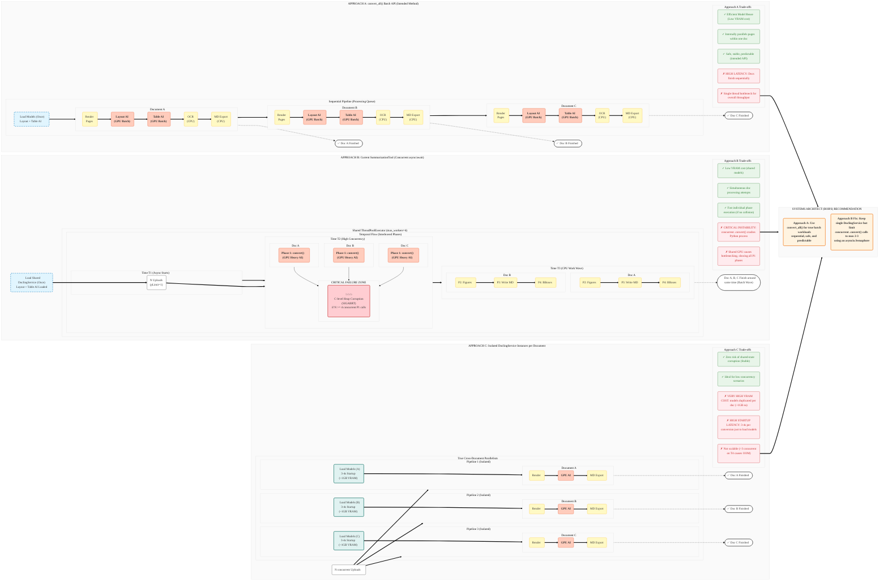

```mermaid
%%{init: {
  'theme': 'base',
  'themeVariables': {
    'primaryColor': '#e3f2fd',
    'edgeLabelBackground':'#ffffff',
    'tertiaryColor': '#fafafa',
    'fontFamily': 'inter, helvetica, sans-serif'
  },
  'flowchart': {
    'nodeSpacing': 30,
    'rankSpacing': 50,
    'curve': 'basis'
  }
}}%%

flowchart LR
    %% ==========================================
    %% GLOBAL STYLES
    %% ==========================================
    classDef plain fill:#fff,stroke:#333,stroke-width:1px;
    classDef sharedModel fill:#e1f5fe,stroke:#0277bd,stroke-width:2px,stroke-dasharray: 5 5;
    classDef newModel fill:#e0f2f1,stroke:#00695c,stroke-width:2px;
    classDef phaseCPU fill:#fff9c4,stroke:#fbc02d,stroke-width:1px,rx:5,ry:5;
    classDef phaseGPU fill:#ffccbc,stroke:#e64a19,stroke-width:1px,font-weight:bold,rx:5,ry:5;
    classDef parallelBoundary fill:none,stroke:#9e9e9e,stroke-width:2px,stroke-dasharray: 3 3;
    classDef crashFill fill:#ffcdd2,stroke:#c62828,stroke-width:2px;
    classDef tradeGood fill:#e8f5e9,stroke:#2e7d32,stroke-width:1px,color:#2e7d32;
    classDef tradeBad fill:#ffebee,stroke:#c62828,stroke-width:1px,color:#c62828;
    classDef recBox fill:#fff3e0,stroke:#ef6c00,stroke-width:2px,font-weight:bold;

    %% ==========================================
    %% APPROACH A: convert_all()
    %% ==========================================
    subgraph ColumnA ["APPROACH A: convert_all() Batch API (Intended Method)"]
        direction TB

        LoadModelsA("📂 Load Models (Once)\nLayout + Table AI"):::sharedModel

        subgraph PipelineA ["Sequential Pipeline (Processing Queue)"]
            direction TB

            subgraph DocA_A ["📄 Document A"]
                direction LR
                A_P1_R("Render\nPages"):::phaseCPU
                A_P1_L("Layout AI\n(GPU Batch)"):::phaseGPU
                A_P1_T("Table AI\n(GPU Batch)"):::phaseGPU
                A_P1_O("OCR\n(CPU)"):::phaseCPU
                A_P1_M("MD Export\n(CPU)"):::phaseCPU

                A_P1_R ==> A_P1_L ==> A_P1_T ==> A_P1_O ==> A_P1_M
            end

            subgraph DocA_B ["📄 Document B"]
                direction LR
                A_P2_R("Render\nPages"):::phaseCPU
                A_P2_L("Layout AI\n(GPU Batch)"):::phaseGPU
                A_P2_T("Table AI\n(GPU Batch)"):::phaseGPU
                A_P2_O("OCR\n(CPU)"):::phaseCPU
                A_P2_M("MD Export\n(CPU)"):::phaseCPU

                A_P2_R ==> A_P2_L ==> A_P2_T ==> A_P2_O ==> A_P2_M
            end

            subgraph DocA_C ["📄 Document C"]
                direction LR
                A_P3_R("Render\nPages"):::phaseCPU
                A_P3_L("Layout AI\n(GPU Batch)"):::phaseGPU
                A_P3_T("Table AI\n(GPU Batch)"):::phaseGPU
                A_P3_O("OCR\n(CPU)"):::phaseCPU
                A_P3_M("MD Export\n(CPU)"):::phaseCPU

                A_P3_R ==> A_P3_L ==> A_P3_T ==> A_P3_O ==> A_P3_M
            end

            LoadModelsA ==> DocA_A
            DocA_A ==> DocA_B
            DocA_B ==> DocA_C
        end

        FinishA_A(["✅ Doc A Finished"]):::plain
        FinishA_B(["✅ Doc B Finished"]):::plain
        FinishA_C(["✅ Doc C Finished"]):::plain

        DocA_A -.-> FinishA_A
        DocA_B -.-> FinishA_B
        DocA_C -.-> FinishA_C

        subgraph TradeoffsA ["Approach A Trade-offs"]
            direction TB
            Ta1("✓ Efficient Model Reuse (Low VRAM cost)"):::tradeGood
            Ta2("✓ Internally parallels pages within one doc"):::tradeGood
            Ta3("✓ Safe, stable, predictable (intended API)"):::tradeGood
            Ta4("✗ HIGH LATENCY: Docs finish sequentially"):::tradeBad
            Ta5("✗ Single thread bottleneck for overall throughput"):::tradeBad
        end
    end


    %% ==========================================
    %% APPROACH B: Current SummarizationTool
    %% ==========================================
    subgraph ColumnB ["APPROACH B: Current SummarizationTool (Concurrent async/await)"]
        direction TB

        LoadModelsB("📂 Load Shared DoclingService (Once)\nLayout + Table AI Loaded"):::sharedModel

        subgraph SharedPoolB ["Shared ThreadPoolExecutor (max_workers=4)"]
            direction TB

            subgraph TimelineB ["Temporal Flow (Interleaved Phases)"]
                direction LR

                subgraph TimeT1 ["Time T1 (Async Starts)"]
                    direction TB
                    B_StartA("N Uploads\n(pLimit=1)"):::plain
                end

                subgraph TimeT2 ["Time T2 (High Concurrency)"]
                    direction TB
                    subgraph DocB_A ["📄 Doc A"]
                        direction LR
                        B_A_P1("Phase 1: convert()\n(GPU Heavy AI)"):::phaseGPU
                    end
                    subgraph DocB_B ["📄 Doc B"]
                        direction LR
                        B_B_P1("Phase 1: convert()\n(GPU Heavy AI)"):::phaseGPU
                    end
                    subgraph DocB_C ["📄 Doc C"]
                        direction LR
                        B_C_P1("Phase 1: convert()\n(GPU Heavy AI)"):::phaseGPU
                    end
                    subgraph CollisionB ["CRITICAL FAILURE ZONE"]
                        CRASH_IMG("\n💥💥💥\nC-level Heap Corruption\n(SIGABRT)\nif N >= 4 concurrent P1 calls"):::crashFill
                    end
                    DocB_A --> CollisionB
                    DocB_B --> CollisionB
                    DocB_C --> CollisionB
                end

                subgraph TimeT3 ["Time T3 (CPU Work Wave)"]
                    direction TB
                    subgraph DocB_A_CPU ["📄 Doc A"]
                        direction LR
                        B_A_P2("P2: Figures"):::phaseCPU
                        B_A_P3("P3: Write MD"):::phaseCPU
                        B_A_P4("P4: BBoxes"):::phaseCPU
                        B_A_P2 ==> B_A_P3 ==> B_A_P4
                    end
                    subgraph DocB_B_CPU ["📄 Doc B"]
                        direction LR
                        B_B_P2("P2: Figures"):::phaseCPU
                        B_B_P3("P3: Write MD"):::phaseCPU
                        B_B_P4("P4: BBoxes"):::phaseCPU
                        B_B_P2 ==> B_B_P3 ==> B_B_P4
                    end
                end

                TimeT1 ==> TimeT2
                TimeT2 ==> TimeT3
            end
        end

        LoadModelsB ==> B_StartA
        B_StartA ==> TimeT2

        FinishB_All(["🌊 Doc A, B, C Finish around same time (Batch Wave)"]):::plain
        TimeT3 -.-> FinishB_All

        subgraph TradeoffsB ["Approach B Trade-offs"]
            direction TB
            Tb1("✓ Low VRAM cost (shared models)"):::tradeGood
            Tb2("✓ Simultaneous doc processing attempts"):::tradeGood
            Tb3("✓ Fast individual phase execution (if no collision)"):::tradeGood
            Tb4("✗ CRITICAL INSTABILITY: concurrent .convert() crashes Python process"):::tradeBad
            Tb5("✗ Shared GPU causes bottlenecking, slowing all P1 phases"):::tradeBad
        end
    end


    %% ==========================================
    %% APPROACH C: Separate instances
    %% ==========================================
    subgraph ColumnC ["APPROACH C: Isolated DoclingService Instances per Document"]
        direction TB

        N_UploadsC("N concurrent Uploads"):::plain

        subgraph ParallelBoundaryC ["True Cross-Document Parallelism"]
            direction TB

            subgraph PipeC_A ["Pipeline 1 (Isolated)"]
                direction TB
                C_LoadA("📂 Load Models (A)\n3-4s Startup\n(~1GB VRAM)"):::newModel
                subgraph DocC_A ["📄 Document A"]
                    direction LR
                    C_A_Render("Render"):::phaseCPU
                    C_A_GPU("GPU AI"):::phaseGPU
                    C_A_Export("MD Export"):::phaseCPU
                    C_A_Render ==> C_A_GPU ==> C_A_Export
                end
                C_LoadA ==> DocC_A
            end

            subgraph PipeC_B ["Pipeline 2 (Isolated)"]
                direction TB
                C_LoadB("📂 Load Models (B)\n3-4s Startup\n(~1GB VRAM)"):::newModel
                subgraph DocC_B ["📄 Document B"]
                    direction LR
                    C_B_Render("Render"):::phaseCPU
                    C_B_GPU("GPU AI"):::phaseGPU
                    C_B_Export("MD Export"):::phaseCPU
                    C_B_Render ==> C_B_GPU ==> C_B_Export
                end
                C_LoadB ==> DocC_B
            end

            subgraph PipeC_C ["Pipeline 3 (Isolated)"]
                direction TB
                C_LoadC("📂 Load Models (C)\n3-4s Startup\n(~1GB VRAM)"):::newModel
                subgraph DocC_C ["📄 Document C"]
                    direction LR
                    C_C_Render("Render"):::phaseCPU
                    C_C_GPU("GPU AI"):::phaseGPU
                    C_C_Export("MD Export"):::phaseCPU
                    C_C_Render ==> C_C_GPU ==> C_C_Export
                end
                C_LoadC ==> DocC_C
            end
        end

        N_UploadsC ==> PipeC_A
        N_UploadsC ==> PipeC_B
        N_UploadsC ==> PipeC_C

        FinishC_A(["✅ Doc A Finished"]):::plain
        FinishC_B(["✅ Doc B Finished"]):::plain
        FinishC_C(["✅ Doc C Finished"]):::plain

        DocC_A -.-> FinishC_A
        DocC_B -.-> FinishC_B
        DocC_C -.-> FinishC_C

        subgraph TradeoffsC ["Approach C Trade-offs"]
            direction TB
            Tc1("✓ Zero risk of shared-state corruption (Stable)"):::tradeGood
            Tc2("✓ Ideal for low concurrency scenarios"):::tradeGood
            Tc3("✗ VERY HIGH VRAM COST: models duplicated per doc (~1GB ea)"):::tradeBad
            Tc4("✗ HIGH STARTUP LATENCY: 3-4s per conversion just to load models"):::tradeBad
            Tc5("✗ Not scalable (>3 concurrent on T4 causes OOM)"):::tradeBad
        end
    end

    %% ==========================================
    %% RECOMMENDATION
    %% ==========================================
    subgraph BobRec ["SYSTEMS ARCHITECT (BOB'S) RECOMMENDATION"]
        direction TB
        RecA("Approach A: Use convert_all() for true batch workloads\nsequential, safe, and predictable"):::recBox
        RecB("Approach B Fix: Keep single DoclingService but limit\nconcurrent .convert() calls to max 2-3\nusing an asyncio.Semaphore"):::recBox
    end

    Ta5 ==> BobRec
    Tb4 ==> BobRec
    Tc5 ==> BobRec
```
