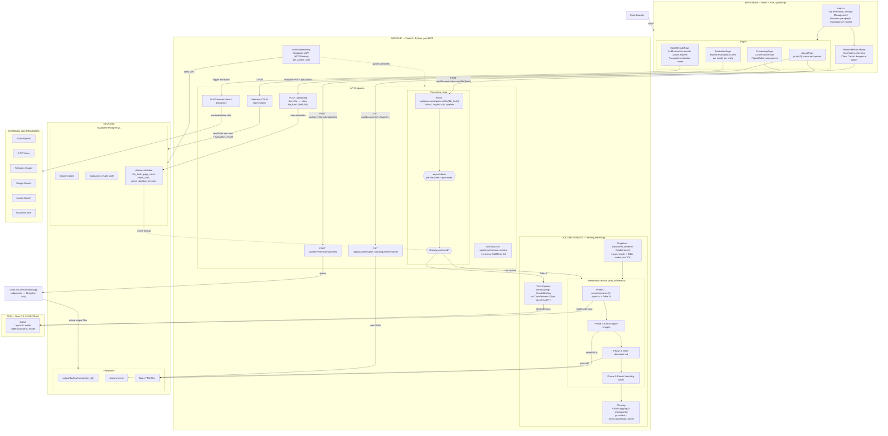

```mermaid
flowchart TD
    User[User Browser]

    subgraph FE["FRONTEND — React + Vite, TypeScript"]
        direction TB
        AppTSX["App.tsx\nTop-level state, Session Management\nRestores paragraph evaluation per model"]
        SessionModal["SessionMetrics Modal\nCost/Latency Metrics\n'Clear Cache' dangerous button"]

        subgraph FEPages[Pages]
            direction LR
            UploadPage["UploadPage\npLimit(1) concurrent upload"]
            ProcessingPage["ProcessingPage\nConversion results\nFigureGallery component"]
            BatchResultsPage["BatchResultsPage\nLLM extraction results across models\nParagraph evaluation scores"]
            EvalPage["EvaluationPage\nHuman evaluation scores\nper model per entity"]
        end

        AppTSX --> FEPages
        AppTSX --> SessionModal
    end

    subgraph BE["BACKEND — FastAPI, Python, port 8001"]
        direction TB
        Auth["Auth Dependency\nSupabase JWT (HTTPBearer)\nget_current_user"]

        subgraph BEEndpoints["API Endpoints"]
            direction TB
            APIUpload["POST /api/upload\nSave file → return file_hash (SHA256)"]

            subgraph ProcessLogic["Processing Logic"]
                APIProcess["POST /api/documents/process/file/{file_hash}\n?vlm=1 flag for VLM pipeline"]
                HashLock{{"asyncio.Lock\nper file_hash + processor"}}
                CacheCheck{{"Already processed?"}}
                APIProcess --> HashLock --> CacheCheck
            end

            APIGetFig["GET /api/documents/{file_hash}/figures/{filename}"]
            APIClearBench["POST /api/server/benchmark/clear"]
            APISessionMetrics["GET/DELETE /api/server/session-metrics\nin-memory CallMetric list"]
            APISessions["Sessions CRUD\n/api/sessions"]
            APISummarize["LLM Summarization / Extraction"]
        end

        subgraph DS["DOCLING SERVICE — docling_service.py"]
            direction TB
            DS_Singleton["Singleton: DocumentConverter (loaded once)\nLayout model + Table model, no OCR"]

            subgraph DSTP["ThreadPoolExecutor (max_workers=4)"]
                direction TB
                DS_P1["Phase 1: converter.convert()\nLayout AI + Table AI"]
                DS_P2["Phase 2: Extract figure images"]
                DS_P3["Phase 3: Write document.md"]
                DS_P4["Phase 4: Extract bounding boxes"]
                DS_P1 --> DS_P2 --> DS_P3 --> DS_P4
            end

            DS_VLM["VLM Pipeline\nSmolDocling / GraniteDocling\nvia Transformers (T4) or vLLM (A100+)"]
            DS_Cleanup["Cleanup\nVRAM logging (8 checkpoints)\ngc.collect + torch.cuda.empty_cache"]

            DS_Singleton --> DSTP
            DS_P4 --> DS_Cleanup
        end

        Auth -.->|"guards all routes"| BEEndpoints
        CacheCheck -->|"not cached"| DSTP
        CacheCheck -->|"?vlm=1"| DS_VLM
    end

    ClearScript["clear_for_benchmarking.py\nsubprocess — filesystem only"]

    subgraph ST["STORAGE"]
        direction LR
        subgraph FS["Filesystem"]
            FSDir["output/docling/{conversion_id}/"]
            FSMD["document.md"]
            FSFig["figure PNG files"]
        end
        subgraph SDB["Supabase PostgreSQL"]
            T_Sessions["sessions table"]
            T_Eval["evaluation_results table"]
            T_Docs["documents table\nfile_hash, page_count\nparse_cost, parse_duration_seconds"]
        end
    end

    subgraph GPU["GPU — Tesla T4, 15 GB VRAM"]
        TeslaT4["CUDA\nLayout AI model\nTable structure AI model"]
    end

    subgraph EX_LLM["EXTERNAL LLM PROVIDERS"]
        direction LR
        AZ_OAI["Azure OpenAI"]
        GCP_Vertex["GCP Vertex"]
        Anth_Claude["Anthropic Claude"]
        G_Gemini["Google Gemini"]
        Llama_AZ["Llama (Azure)"]
        Mac_Local["MacBook local"]
    end

    %% ── Data Flow ──────────────────────────────────────────────
    User -->|"HTTP"| FE

    UploadPage -->|"multipart POST /api/upload"| APIUpload
    UploadPage -->|"POST /api/documents/process/file/{hash}"| APIProcess
    ProcessingPage -->|"GET /api/documents/.../figures/..."| APIGetFig
    SessionModal -->|"POST /api/server/benchmark/clear"| APIClearBench
    EvalPage -->|"CRUD"| APISessions
    BatchResultsPage -->|"trigger extraction"| APISummarize

    Auth -->|"verify JWT"| SDB
    APIUpload -->|"store metadata"| T_Docs
    APISessions -->|"read/write sessions\n+ evaluation_results"| SDB
    T_Docs -.->|"cache lookup"| CacheCheck

    DS_P1 -->|"model inference"| TeslaT4
    DS_VLM -->|"VLM inference"| TeslaT4

    DS_P2 -->|"write PNGs"| FSFig
    DS_P3 -->|"write MD"| FSMD

    APIGetFig -->|"read PNGs"| FSFig

    APIClearBench -->|"spawn"| ClearScript
    ClearScript -->|"delete output files"| FS

    APISummarize -->|"summarization calls"| EX_LLM
```
