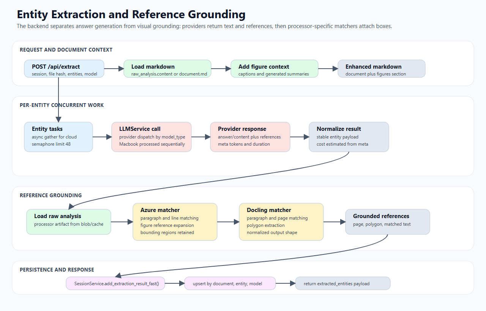

# Entity Extraction Flow Technical Design

This document describes how the backend extracts structured entity answers from processed documents, attaches reference/bounding-box data, records cost, and persists results into sessions.

## 1. Scope

In scope:

- `POST /api/extract` interface behavior;
- entity request types;
- markdown and figure-context construction;
- LLM provider routing;
- provider response normalization;
- reference and bounding-box matching;
- persistence into `extraction_results`;
- timeout logging and cost/session metrics.

Out of scope:

- frontend prompt-template editing;
- model-provider provisioning;
- evaluation of extracted answers, which is covered in [08-evaluation-flow.md](08-evaluation-flow.md).

## Visual workflow



The extraction path has two distinct technical phases. First, the router builds an enhanced markdown context from processed document content and available figure summaries, then fans out one provider call per entity. Cloud models run concurrently behind a semaphore; Macbook-backed models are submitted sequentially because the local runtime is already serialized by a FIFO queue. Second, structured references from the provider are matched back to parser raw analysis. Azure matching can use paragraph, line, and figure metadata; Docling matching uses paragraph/page structures and polygons. Persistence upserts by `(document_id, entity_name, model_id)` so reruns replace the same entity/model result instead of duplicating it.

## 2. Main files and classes

| Component | File | Responsibility |
| --- | --- | --- |
| extraction router | `backend/api/extractions/router.py` | HTTP endpoint, per-entity task orchestration, persistence. |
| `ExtractRequest` / `Entity` | `backend/schemas/extractions.py` | API request schemas. |
| `DocumentService` | `backend/services/document/document_service.py` | Markdown/raw-analysis/figure retrieval. |
| `LLMService` | `backend/services/llm/llm_service.py` | Provider dispatch. |
| bbox matchers | `backend/services/document/processors/*/bounding_box_matcher.py` | Reference-to-bbox matching. |
| `SessionService` | `backend/services/session/session_service.py` | Persist extraction results. |
| `ExtractionResult` ORM | `backend/models/extraction.py` | Physical extraction row. |
| `ExtractionResult` schema | `backend/schemas/sessions.py` | Session API extraction result. |

## 3. API contract

Endpoint:

```text
POST /api/extract
```

Request body: `ExtractRequest`

Important fields:

- `conversion_id`: file hash / document conversion id;
- `session_id`: optional session id for persistence;
- `entities`: list of `Entity` objects;
- `model_type`: provider route, e.g. `azure`, `gemini`, `anthropic`, `llama`, `macbook`, `vllm`;
- `model_id`, `deployment`, `api_version`, provider-specific credentials/config;
- `max_tokens`, `temperature`;
- `processor_used`: optional preferred processor subtree.

Each `Entity` contains:

- `name`
- `prompt`
- optional `extracted`
- optional `system_prompt`

## 4. High-level sequence

```text
POST /api/extract
  -> validate auth dependency
  -> load markdown for conversion_id
  -> load figure metadata/context when available
  -> for each entity:
       call LLMService.extract_entities_from_markdown()
       normalize provider result
       load raw analysis when needed
       match references to bounding boxes
       build entity result dict
  -> persist results to session when session_id provided
  -> return extraction result payload
```

## 5. Markdown loading

The router uses `DocumentService.get_markdown_content(conversion_id, processor_used)`.

Resolution behavior:

1. Resolve processor via `OrganizedFileService.resolve_processed_processor()`.
2. Try `document.md` in the processed artifact tree.
3. If missing, optionally fall back to `raw_analysis.json` content field.

If markdown cannot be loaded, extraction fails with a not-found/error response.

## 6. Figure context construction

The extraction router can build extra figure context with `_build_figures_context(figures, conversion_id)`.

Inputs:

- figure metadata from `DocumentService.get_figures_for_conversion()`;
- figure summaries stored in metadata, when previously generated.

Purpose:

- Give text-only extraction models more context about figures and visual content.
- Preserve figure ids/captions/summaries in the prompt context.

The figure context is appended to or included with document markdown before provider calls, depending on route logic.

## 7. Per-entity extraction task

The router creates one async task per requested entity.

For each entity:

1. Combine document markdown, figure context, and the entity prompt.
2. Use the entity-level `system_prompt` if present.
3. Call `LLMService.extract_entities_from_markdown()` with provider configuration.
4. Interpret result success/failure.
5. Extract answer text from provider-specific fields.
6. Extract token usage, duration, and raw references from `meta` / provider response.
7. Match references to bounding boxes if possible.
8. Return an entity result object.

## 8. Provider response handling

Provider result dictionaries vary. Common extraction answer candidates include:

- `answer`
- `content`
- `extracted_text`
- provider-specific generated fields

Common reference candidates include:

- `references`
- structured JSON references inside `raw`

Common metadata fields include:

- `meta.model`
- `meta.deployment`
- `meta.prompt_tokens`
- `meta.completion_tokens`
- `meta.duration`

The extraction flow treats provider dictionaries as semi-structured and maps them into the stable session extraction schema.

## 9. Bounding-box matching

### 9.1 Raw analysis loading

When references exist or bbox matching is requested, the router reads raw analysis through:

```python
DocumentService.get_raw_analysis_result(conversion_id, processor_used)
```

Then the raw analysis is normalized with `normalize_bbox_format()` or routed to processor-specific matchers.

### 9.2 Azure matching

Azure matcher behavior:

1. Normalize text.
2. Search paragraphs for exact/substring/similarity matches.
3. Fall back to page lines when paragraph match is weak or absent.
4. Extract figure references such as `Figure 1`, `Fig. 2`, etc.
5. Match figure ids to Azure figure metadata.
6. Return paragraph matches, line matches, best match, and figure-enriched matches.

Returned data can include:

- matched text;
- similarity score;
- page number;
- polygon/bounding regions;
- paragraph content;
- line content;
- figure id/caption/reference.

### 9.3 Docling matching

Docling matcher behavior:

1. Normalize text.
2. Search paragraphs.
3. Fall back to page-level matching.
4. Extract and validate 8-number polygons where available.

Docling matching is simpler than Azure matching because Docling raw analysis does not always include line-level structures equivalent to Azure.

## 10. Persistence

If `session_id` is provided, each successful or failed entity result can be persisted through:

```python
SessionService.add_extraction_result_fast(session_id, user_id, result)
```

`SessionService` resolves the target document by:

1. explicit `document_id`, if present;
2. `file_hash`, if present;
3. cached session documents;
4. DB lookup.

Important multi-document guard:

- If a session has multiple documents and an extraction result lacks `file_hash`/document identity, the service refuses to guess and returns `False`.

DB upsert target:

```text
(document_id, entity_name, model_id)
```

Constraint name:

```text
uq_extraction_doc_entity_model
```

## 11. Extraction DB shape

Persisted `ExtractionResult` ORM fields:

- `session_id`
- `document_id`
- `entity_name`
- `model_id`
- `extracted_text`
- `bbox_references`
- `status`
- `error_message`
- `extracted_at`
- `prompt_tokens`
- `completion_tokens`
- `duration_ms`
- `cost`

The session API later converts this into `schemas.sessions.ExtractionResult` with `references` instead of `bbox_references`.

## 12. Cost and timing

Provider clients include token and duration metadata when available. `LLMService` records session metrics on successful provider responses. The extraction persistence layer also stores per-extraction token, duration, and cost fields when provided.

If stored cost is missing or zero, `SessionService._db_to_session()` can recompute estimated cost from token counts and model id using `cost_tracker` and backfill the DB.

## 13. Timeout and error logging

`LLMService` wraps provider calls with timeout logging. The extraction router also has a `log_timeout_event()` helper to write extraction timeout details.

Common error outputs:

- provider disabled;
- provider API failure;
- timeout;
- markdown/document not found;
- bbox analysis unavailable;
- DB persistence failure.

Provider/API failures are generally returned as failed entity results rather than aborting the entire batch when possible.

## 14. Algorithms to preserve

### 14.1 Per-entity concurrency

Entities are extracted concurrently so one request can produce multiple entity results faster. Persistence also uses async task-style behavior for entity result writes.

### 14.2 Figure-context augmentation

Figure metadata and summaries are converted into text context. This gives text LLMs access to visual analysis without requiring every extraction call to invoke a vision model.

### 14.3 Reference grounding

Structured provider references are mapped to parser raw analysis. The design decouples extraction answer generation from visual grounding: providers produce textual references, then backend matchers map those references to bounding boxes.

### 14.4 Multi-document safety

`SessionService` avoids cross-document contamination by requiring file/document identity when a session contains multiple documents.

## 15. Related docs

- [02-api-surface.md](02-api-surface.md)
- [04-schemas.md](04-schemas.md)
- [05-document-processing.md](05-document-processing.md)
- [06-llm-layer.md](06-llm-layer.md)
- [09-session-sharing-groups.md](09-session-sharing-groups.md)
