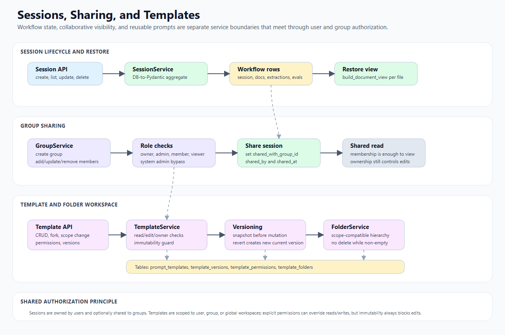

# Template System Technical Design

This document describes the prompt template workspace: templates, folders, scopes, versions, immutability, forks, and permissions.

## 1. Scope

In scope:

- template CRUD;
- folder CRUD;
- user/group/global scopes;
- access-control algorithms;
- version snapshots and revert;
- fork and scope-change behavior;
- explicit per-user template permissions.

Out of scope:

- frontend template editor UI;
- prompt quality/content strategy.

## Visual workflow



Read the bottom half of the diagram for template behavior. Template APIs call `TemplateService` and `FolderService`, which enforce user, group, and global scopes before touching `prompt_templates` or `template_folders`. Updates snapshot the current prompt fields into `template_versions` before mutation, so revert creates a new current version rather than rolling the row back in place. Explicit `template_permissions` can grant user-level read/write access, but `is_immutable` is evaluated first and always blocks edits.

## 2. Main classes and files

| Component | File | Responsibility |
| --- | --- | --- |
| `TemplateService` | `backend/services/templates/template_service.py` | Template CRUD, permissions, versions, forks, scope changes. |
| `FolderService` | `backend/services/templates/folder_service.py` | Folder hierarchy and folder permission checks. |
| template router | `backend/api/templates/router.py` | HTTP API for templates/folders. |
| `PromptTemplate` | `backend/models/template.py` | Main template ORM model. |
| `TemplateVersion` | `backend/models/template.py` | Version snapshot ORM model. |
| `TemplatePermission` | `backend/models/template.py` | Per-user permission ORM model. |
| `TemplateFolder` | `backend/models/template.py` | Folder ORM model. |
| `GroupService` | `backend/services/groups/group_service.py` | Group role checks for group-scoped resources. |

## 3. Template data model

`PromptTemplate` stores:

- `name`
- `description`
- `study_type`
- `scope`: `user`, `group`, or `global`
- `owner_user_id`
- `owner_group_id`
- `system_prompt`
- `entities` JSONB
- `summary_prompt`
- `variables` JSONB
- `is_immutable`
- `tags`
- `is_default`
- `version`
- `folder_id`
- `created_by`
- timestamps

The `scope` determines default read/edit behavior.

## 4. Folder data model

`TemplateFolder` stores:

- `name`
- `scope`
- `owner_user_id`
- `owner_group_id`
- `parent_id`
- `created_by`
- timestamps

Folders can be hierarchical through `parent_id`.

Folder deletion is intentionally non-cascading: the service refuses to delete a folder that contains templates or subfolders.

## 5. Template creation

Endpoint:

```text
POST /api/templates
```

`TemplateService.create_template()` rules:

- `scope` must be `user`, `group`, or `global`.
- `group` scope requires `owner_group_id`.
- For group scope, requester must have role `member`, `admin`, or `owner` in that group.
- User-scope templates set `owner_user_id=user_id`.
- Group-scope templates set `owner_group_id`.
- New templates start at `version=1`.
- `created_by` is the requesting user.

Global scope is allowed by this service without a special admin guard in current code.

## 6. Template read/list

### 6.1 Get one template

Endpoint:

```text
GET /api/templates/{template_id}
```

`TemplateService.get_template()`:

1. loads template by id;
2. checks `_can_read()`;
3. returns `None` if unreadable;
4. adds `can_edit` and `is_owner` flags to response.

### 6.2 List templates

Endpoint:

```text
GET /api/templates
```

Supports filters:

- `scope`
- `study_type`
- search across name/description
- tags

List behavior:

1. query candidate templates;
2. load current user's groups;
3. apply `_can_read()` in memory;
4. annotate `can_edit`, `is_owner`, and group name where relevant;
5. apply tag filter using any-match semantics.

Because access checks are applied after the DB query, query result count can be larger than final response count.

## 7. Template update and versioning

Endpoint:

```text
PUT /api/templates/{template_id}
```

`TemplateService.update_template()`:

1. requires readable template;
2. requires `_can_edit()`;
3. snapshots current content into `TemplateVersion` before mutation;
4. updates allowed fields;
5. increments `version`;
6. updates timestamp;
7. returns updated template.

Allowed update fields:

- `name`
- `description`
- `study_type`
- `system_prompt`
- `entities`
- `summary_prompt`
- `variables`
- `tags`
- `is_immutable`
- `folder_id`

If no valid update fields are provided, the current template is returned unchanged.

## 8. Version history and revert

Endpoints:

```text
GET  /api/templates/{template_id}/versions
POST /api/templates/{template_id}/revert/{version}
```

Version history:

- requires read permission;
- returns snapshots ordered by version descending.

Revert behavior:

1. requires read and edit permission;
2. loads requested `TemplateVersion`;
3. calls `update_template()` with snapshot fields;
4. creates a new version snapshot as part of the update path.

Reverting does not reuse the old version number; it creates a new current version.

## 9. Forking

Endpoint:

```text
POST /api/templates/{template_id}/fork
```

`TemplateService.fork_template()`:

1. loads source through `get_template()` so read permission applies;
2. creates a new user-scope copy;
3. defaults name to `Copy of {source_name}` unless provided;
4. sets `is_immutable=False`.

Forked templates are always personal/user scoped.

## 10. Scope changes

Endpoint:

```text
PUT /api/templates/{template_id}/scope
```

`TemplateService.change_scope()` validates the target scope and enforces rules based on old scope.

### 10.1 Old user scope

- Requester must own the template.
- Moving to group scope requires membership/admin/owner role in target group.

### 10.2 Old group scope

- Requester must be admin/owner of current group.
- Moving to another group requires membership/admin/owner in target group.

### 10.3 Old global scope

- Requester must be `created_by`.

### 10.4 Ownership fields

The service updates ownership fields according to target scope:

- user scope: `owner_user_id=user_id`, `owner_group_id=None`;
- group scope: `owner_user_id=None`, `owner_group_id=target group`;
- global scope: both owner fields cleared.

## 11. Immutability

Endpoint:

```text
PUT /api/templates/{template_id}/immutable
```

Rules:

- User-scope template owner can set immutability.
- Group-scope admin/owner can set immutability.
- Global scope currently returns `None` for this operation.

`_can_edit()` always denies edits when `is_immutable=True`, regardless of other permissions.

## 12. Explicit permissions

Endpoints:

```text
GET    /api/templates/{template_id}/permissions
POST   /api/templates/{template_id}/permissions
DELETE /api/templates/{template_id}/permissions/{user_id}
```

`TemplatePermission` fields:

- `template_id`
- `user_id`
- `can_read`
- `can_write`
- `granted_by`

Permissions can be managed by:

- user-scope template owner;
- group-scope admin/owner.

Global scope is disallowed for explicit permission operations.

Permission upsert uses unique constraint:

```text
(template_id, user_id)
```

## 13. Access-control algorithms

### 13.1 `_can_read(template, user_id)`

Algorithm:

1. Global scope is readable by anyone.
2. User scope is readable by owner.
3. Group scope is readable by group members.
4. Otherwise, explicit `TemplatePermission.can_read` can grant read access.

### 13.2 `_can_edit(template, user_id)`

Algorithm:

1. If immutable, deny.
2. If explicit permission exists, use `can_write`.
3. User scope: owner can edit.
4. Group scope: member/admin/owner can edit by default.
5. Global scope: creator can edit.

Important implication:

- Explicit user permission is checked before default scope edit rules, but immutability always wins.

### 13.3 `_is_owner(template, user_id)`

Algorithm:

- User scope: owner user id matches.
- Group scope: group admin/owner counts as owner.
- Global scope: creator counts as owner.

## 14. Folder operations

### 14.1 List folders

Endpoint:

```text
GET /api/templates/folders
```

Filters:

- scope;
- owner user/group;
- parent id.

Top-level folders are selected with `parent_id is None`.

### 14.2 Create folder

Endpoint:

```text
POST /api/templates/folders
```

Rules:

- Name must be non-empty.
- User scope is manageable by the user.
- Group scope requires admin/owner role in owning group.
- Global scope is currently allowed by `_can_manage_folder()`.
- Parent folder must have the same scope.
- Group parent folder must have the same owning group.

### 14.3 Rename folder

Endpoint:

```text
PATCH /api/templates/folders/{folder_id}
```

Allowed if:

- user can manage the folder scope; or
- user originally created the folder.

### 14.4 Delete folder

Endpoint:

```text
DELETE /api/templates/folders/{folder_id}
```

Allowed if:

- user can manage folder scope; or
- user originally created the folder.

Deletion is refused when:

- any template has `folder_id` equal to the folder;
- any subfolder has `parent_id` equal to the folder.

Return shape on success:

```json
{"deleted": "folder-id"}
```

## 15. Risks and implementation notes

- Global-scope creation and global folder management are permissive in current service code.
- `PromptTemplate.folder_id` is a logical association but no ORM FK is declared.
- Group-scope edit permission allows any member/admin/owner by default, unless immutable or explicit permission logic changes.
- Tag filtering is in-memory and uses any-match semantics.
- Version snapshots are created before update, so snapshot version represents the previous state.

## 16. Related docs

- [03-data-models.md](03-data-models.md)
- [04-schemas.md](04-schemas.md)
- [09-session-sharing-groups.md](09-session-sharing-groups.md)
- [11-auth-security-observability.md](11-auth-security-observability.md)
