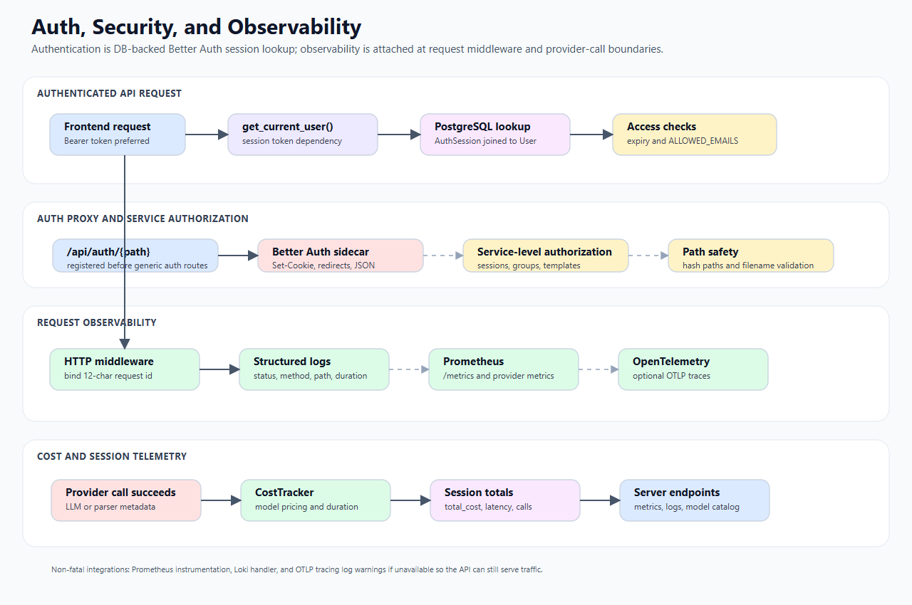

# Auth, Security, and Observability Technical Design

> *Three cross-cutting concerns that touch every part of the backend: who is allowed in (authentication via Better Auth and GitHub OAuth), what they're allowed to do (authorization per endpoint and resource), and what the system records about its own behaviour (structured logs, Prometheus metrics, OpenTelemetry traces, and per-session cost tracking). This document covers all three — including the security risks table, CORS configuration, secrets loading, and how the CostTracker updates the database without blocking the request loop.*

This document describes authentication, authorization boundaries, security-sensitive behaviors, logging, metrics, tracing, and cost/session telemetry.

## 1. Scope

In scope:

- Better Auth session validation in FastAPI;
- auth proxy behavior;
- CORS configuration;
- service-level authorization boundaries;
- file/path safety considerations;
- logging and request IDs;
- Prometheus/OpenTelemetry/Loki hooks;
- cost/session telemetry.

Out of scope:

- Better Auth sidecar internal TypeScript implementation;
- OAuth provider setup details;
- cloud IAM policy design.

## Visual workflow



The diagram shows the cross-cutting path that every protected request follows. FastAPI dependencies extract the Better Auth session token, prefer the `Authorization` header, join `AuthSession` to `User`, check expiry and optional email allowlist, then pass a compact user dict into the route. Authorization is deliberately service-owned: session ownership, group roles, template scope, and artifact path safety are enforced after authentication. Observability is attached at two places: request middleware logs request id, status, and duration; provider/parser paths record model, token, duration, and cost telemetry into in-memory metrics, Prometheus metrics when available, and session totals in PostgreSQL.

## 2. Authentication model

The backend does not validate JWTs. It validates Better Auth sessions by looking up session tokens in PostgreSQL.

Main file:

```text
backend/core/auth.py
```

### 2.1 `get_current_user(request)`

Flow:

```text
extract token
  -> query AuthSession joined to User
  -> reject missing session
  -> reject expired session
  -> optional ALLOWED_EMAILS allowlist check
  -> return user dict
```

Accepted token locations:

1. `Authorization: Bearer <token>` header.
2. `better-auth.session_token` cookie fallback.

The code prefers the header because Better Auth v1.2+ hashes tokens before storing them in the DB, and the frontend may send the DB/hash token from the get-session API.

Returned user shape:

```json
{
  "id": "user-id",
  "email": "user@example.com",
  "name": "Display Name",
  "image": "avatar-url",
  "is_admin": false
}
```

Failure behavior:

- no token: HTTP 401;
- invalid token: HTTP 401;
- expired token: HTTP 401;
- email not allowed: HTTP 403;
- unexpected auth error: HTTP 401.

### 2.2 `get_optional_user(request)`

Returns `None` instead of raising for auth failure. Used by endpoints that can work with optional authentication.

## 3. Auth proxy

File:

```text
backend/api/auth/proxy.py
```

Purpose:

```text
/api/auth/{path:path} -> Better Auth sidecar /api/auth/{path}
```

Important behavior:

- Auth proxy router is registered first in `main.py`.
- Forwards methods such as GET, POST, PUT, PATCH, DELETE, OPTIONS.
- Passes through `Set-Cookie` and redirect responses.
- Adds forwarded host/proto headers.
- Strips hop-by-hop headers.
- Can enforce email allowlist behavior for session lookup.

This lets production route all auth traffic through the same public frontend/backend origin without nginx.

## 4. Authorization boundaries

Authentication only identifies the user. Authorization is mostly enforced in service classes.

| Area | Authorization owner |
| --- | --- |
| Sessions | `SessionService`, `SQLAlchemyDBService` filter by `user_id`; shared sessions check group membership. |
| Groups | `GroupService` role checks and system-admin bypass. |
| Templates | `TemplateService` scope, owner, group role, explicit permission, immutability checks. |
| Folders | `FolderService` scope/group/creator checks. |
| Files/documents | File hash access is less strongly permission-scoped; user document listing uses DB user association. |
| Evaluation jobs | Job records include user/session ids, but in-memory polling primarily uses job id. |

## 5. CORS

File:

```text
backend/core/middleware.py
```

`setup_cors(app)` reads:

```text
CORS_ALLOWED_ORIGINS
```

Behavior:

- If unset, defaults to `*` for local development.
- If set, splits comma-separated origins.
- Allows credentials, all methods, and all headers.

Production should set explicit allowed origins.

## 6. Configuration and secrets loading

### 6.1 `main.load_secrets_to_env()`

Loads TOML secrets from candidate paths and maps sections/keys to uppercase environment variables.

Special case:

- `Macbook.macbook_llm_base_url` -> `MACBOOK_LLM_BASE_URL`

### 6.2 `core.config.load_config()`

Loads provider-specific config from `backend/core/secrets.toml`.

Supported sections include:

- `azure_openai`
- `azure_doc_intelligence`
- `vertex_ai`
- `anthropic`

It also supports `azure_openai.models` as a multi-model JSON list stored in `AZURE_OPENAI_MODELS`.

Google credentials are detected from a service-account JSON file under `backend/core/` and mapped to `GOOGLE_APPLICATION_CREDENTIALS`.

## 7. File and path safety

Important safety mechanisms:

- Uploaded files are addressed by SHA-256 content hash, not arbitrary user paths.
- Blob paths are generated by service code under `global/{hash}/...`.
- Processed artifacts are addressed by known relative paths such as `document.md`, `metadata.json`, `raw_analysis.json`, `figures/*`, and `tables/*`.
- Figure/table-serving endpoints validate filenames before reading artifact bytes.
- Text persisted to PostgreSQL is sanitized by `sanitize_text()` in DB service paths to remove null bytes and unsupported control characters.

Important caveat:

- Several document endpoints operate by file hash/document id and should be reviewed carefully before making files publicly guessable or exposing hashes outside authenticated contexts.

## 8. Structured logging

File:

```text
backend/core/logging_config.py
```

`setup_logging()` configures:

- structlog JSON rendering;
- stdout handler;
- file handler at `backend/output/logs/app.log`;
- optional Loki handler when `LOKI_URL` is configured.

Noisy libraries are reduced to warning level:

- `httpx`
- `httpcore`
- `urllib3`
- `uvicorn.access`

## 9. Request observability middleware

`main.create_app()` installs an HTTP middleware that:

1. creates a 12-character request id;
2. clears and binds structlog context variables;
3. measures duration;
4. logs at:
   - error for HTTP 500+;
   - warning for HTTP 400+;
   - info for success;
5. attaches `X-Request-Id` response header.

This is the primary per-request logging path.

## 10. Global exception handling

`main.create_app()` registers a global exception handler for `Exception`.

Behavior:

- logs type, method, path, and traceback;
- returns HTTP 500 with:

```json
{"detail": "<exception text>"}
```

Expected API errors should still use `HTTPException` in routers/services.

## 11. Prometheus metrics

`main.create_app()` attempts to install `prometheus_fastapi_instrumentator`.

If available:

```text
GET /metrics
```

is exposed outside the OpenAPI schema.

`CostTracker` also optionally emits Prometheus counters/histograms when `prometheus_client` is installed:

- token counter by provider/model/token type;
- cost counter in cents;
- duration histogram.

## 12. OpenTelemetry tracing

`main._setup_otel(app)` enables tracing when:

```text
OTLP_ENDPOINT
```

is set.

Behavior:

- creates `TracerProvider` with service name `summarization-backend`;
- sends spans through OTLP HTTP exporter to `{OTLP_ENDPOINT}/v1/traces`;
- instruments FastAPI app.

Failure to configure tracing is warning-logged and non-fatal.

## 13. Browser trace proxy

Endpoint:

```text
POST /api/telemetry/traces
```

The server router can proxy browser OTLP trace payloads to the configured tracing backend. This keeps browser instrumentation from needing direct access to the telemetry backend.

## 14. Cost tracking

File:

```text
backend/services/telemetry/cost_tracker.py
```

Main classes:

- `CallMetric`
- `BatchMetric`
- `SessionMetrics`
- `CostTracker`

### 14.1 Pricing config

Pricing is loaded from:

```text
backend/config/pricing.json
```

Optional override:

```text
PRICING_JSON_OVERRIDE
```

Overrides are JSON and merged into the pricing map.

### 14.2 Cost algorithm

`CostTracker._compute_cost()` supports:

- token cost per million tokens;
- token cost per thousand tokens;
- page cost for document parsing;
- compute cost per minute for local/self-hosted runtimes.

Model/provider normalization handles Azure, Vertex/Gemini, Claude, Llama, Docling, Azure Document Intelligence, Macbook, and vLLM-style ids.

### 14.3 Recording calls

`record_call()` updates in-memory session aggregate:

- `total_cost`
- `total_latency`
- `total_calls`
- list of calls

It also:

- emits Prometheus metrics when available;
- updates DB session metrics through `SQLAlchemyDBService.increment_session_metrics()`.

The DB write is scheduled through an executor when an event loop is running so telemetry does not block the async request path.

### 14.4 Batch metrics

`record_batch()` stores `BatchMetric` under the session state.

### 14.5 Restore and clear

- `load_session_metrics_from_db(session_id)` reconstructs aggregate metrics from DB totals.
- `clear_session(session_id)` clears in-memory metrics and resets DB totals.

## 15. Server metrics/config endpoints

Router file:

```text
backend/api/server/router.py
```

Important endpoints:

- `/api/server/health`
- `/api/server-config`
- `/api/models`
- `/api/server/session-metrics`
- `/api/server/session-metrics/load`
- `/api/server/batch-metrics`
- `/api/server/document-metrics`
- `/api/server/logs`

These endpoints expose operational health, provider availability, model catalog, session metrics, document metrics, and recent logs.

## 16. Security risks and mitigations

| Risk | Current mitigation | Remaining concern |
| --- | --- | --- |
| Unauthenticated API access | Most routers use `Depends(get_current_user)`. | Some utility endpoints are intentionally unauthenticated; review before public deployment. |
| Token misuse | Sessions are looked up in DB and expiry checked. | Header/cookie token behavior depends on Better Auth token hashing mode. |
| Unauthorized session reads | Session queries filter by `user_id`; shared reads require group membership. | File hash endpoints should be reviewed if hashes leak. |
| Group privilege escalation | `GroupService` protects owner/admin transitions and only-owner removal. | System-admin behavior should be audited when admin assignment changes. |
| Template unauthorized edits | `TemplateService` checks scope, owner, group role, explicit permissions, and immutability. | Global-scope operations are permissive in current code. |
| Path traversal for artifacts | Service-generated blob paths and filename validation for figure/table endpoints. | Keep all future artifact reads on service-generated relative paths. |
| PostgreSQL null-byte errors | `sanitize_text()` strips null/control chars before DB writes in key paths. | Ensure new text persistence paths use sanitizer. |
| Provider rate limits | Provider clients and evaluation adapters use semaphores/retries/timeouts. | Retry policies vary by provider; background job `MAX_ATTEMPTS` is currently 1. |

## 17. Related docs

- [01-architecture.md](01-architecture.md)
- [02-api-surface.md](02-api-surface.md)
- [06-llm-layer.md](06-llm-layer.md)
- [08-evaluation-flow.md](08-evaluation-flow.md)
- [appendices/risks-assumptions-testing.md](appendices/risks-assumptions-testing.md)
