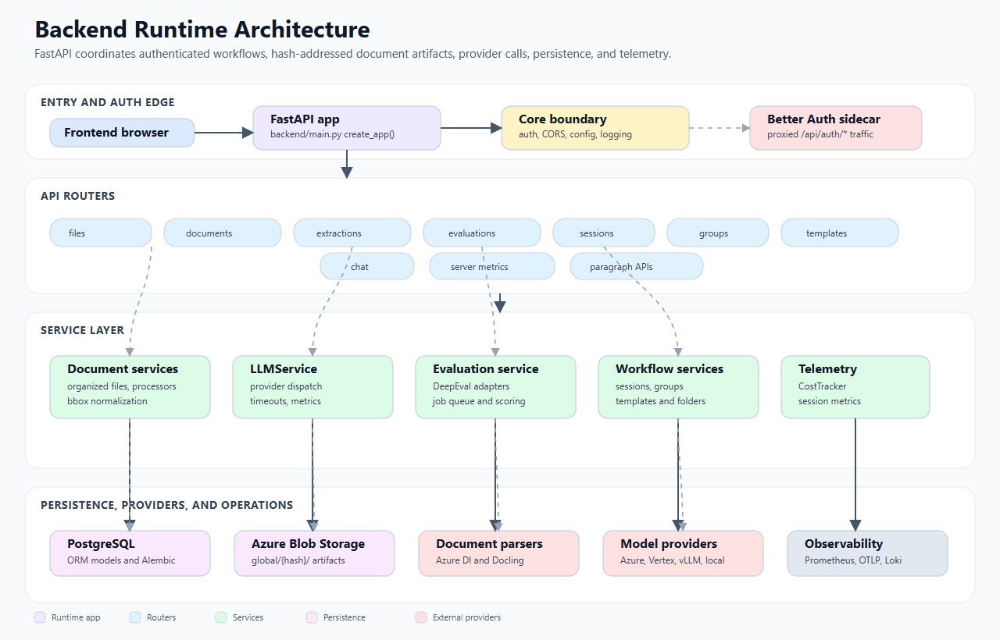
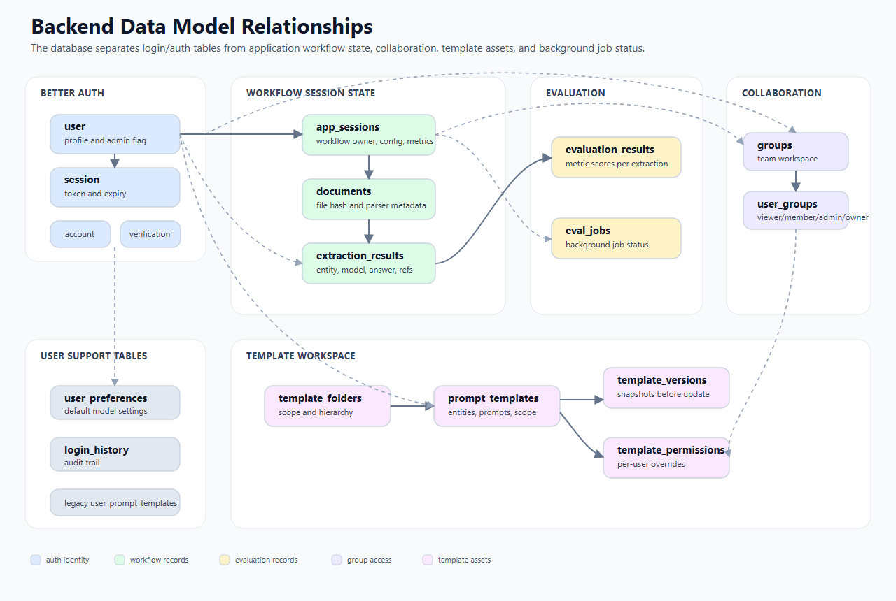
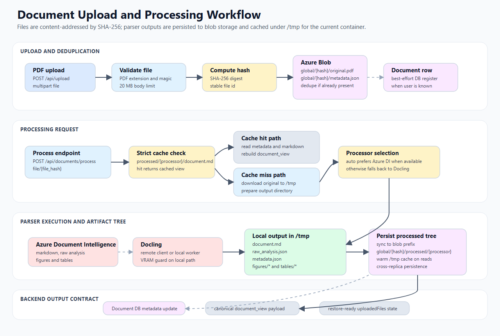
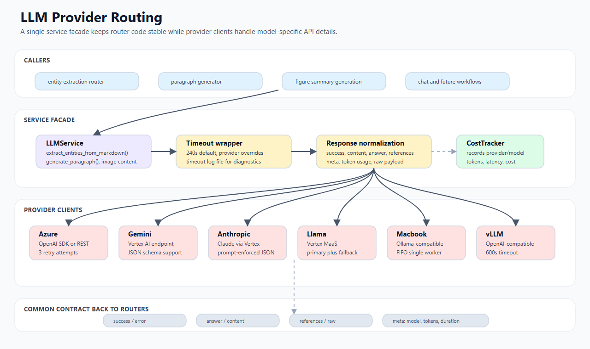
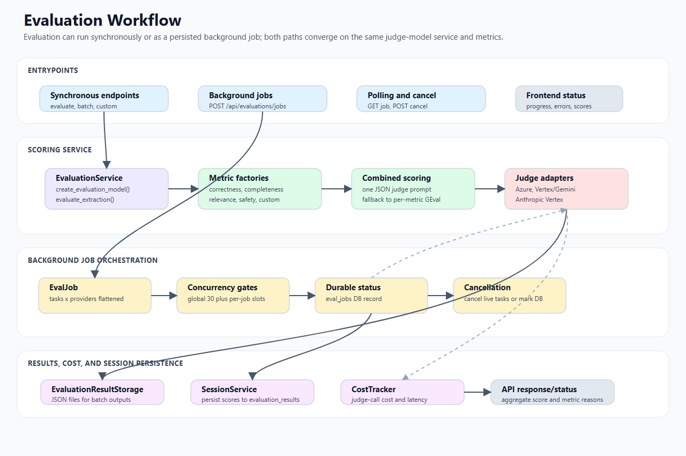

# Backend Technical Design Document

This documentation set is a layered Technical Design Document (TDD) for the FastAPI backend in `backend/`. It is written from the implementation and is intended to help reviewers understand how the system is implemented in code: API boundaries, classes, data models, algorithms, infrastructure assumptions, risks, and testing strategy.

The backend is not documented as one long README because the codebase contains several distinct subsystems: authentication, document processing, LLM routing, entity extraction, evaluation, sessions, groups, templates, storage, telemetry, and deployment hooks. Start here, then follow the module links for details.

## Visual workflow map

The backend diagrams are stored under [`images/`](images/) and are embedded below in the same order as the detailed module documents. They are intentionally implementation-oriented: boxes map to routers, services, tables, providers, or storage paths that exist in `backend/`.

### Backend Runtime Architecture

Runtime layers from browser/API edge to routers, services, persistence, external providers, and observability. Details: [01-architecture.md](01-architecture.md).

### Backend Data Model Relationships

How Better Auth tables, workflow tables, evaluation jobs, groups, and templates relate. Details: [03-data-models.md](03-data-models.md).

### Document Upload and Processing Workflow

Upload validation, SHA-256 deduplication, parser selection, artifact generation, blob sync, and document-view output. Details: [05-document-processing.md](05-document-processing.md).

### LLM Provider Routing Workflow

`LLMService` dispatch, timeout handling, provider clients, response normalization, and cost tracking. Details: [06-llm-layer.md](06-llm-layer.md).

### Entity Extraction and Grounding Workflow

Per-entity LLM fan-out, figure context, reference extraction, bbox matching, and extraction persistence. Details: [07-extraction-flow.md](07-extraction-flow.md).

### Evaluation Workflow

Synchronous and background LLM-as-a-judge evaluation, metric factories, job concurrency, cancellation, and result storage. Details: [08-evaluation-flow.md](08-evaluation-flow.md).

### Session Sharing and Template Workflow

Session restore, group sharing, template scopes, permissions, folders, and version snapshots. Details: [09-session-sharing-groups.md](09-session-sharing-groups.md) and [10-template-system.md](10-template-system.md).

### Auth, Security, and Observability Workflow

Better Auth session lookup, auth proxy, service authorization, request logs, metrics, traces, and session telemetry. Details: [11-auth-security-observability.md](11-auth-security-observability.md).

## 1. Introduction

### 1.1 Problem

The application needs a backend that can ingest user-uploaded scientific documents, parse them into machine-readable artifacts, run prompt-based entity extraction with multiple model providers, evaluate extraction quality, and persist collaborative workflow state for later restoration and sharing.

The implementation problem is larger than a single endpoint or service because the backend must coordinate:

- authenticated access through Better Auth sessions stored in PostgreSQL;
- file upload, deduplication, blob-backed artifact storage, and local cache hydration;
- document parsing through Azure Document Intelligence and Docling;
- model-provider routing across Azure OpenAI, Gemini/Vertex, Anthropic-on-Vertex, Llama MaaS, Macbook-hosted models, and vLLM;
- extraction and figure-reference grounding against document analysis output;
- DeepEval-based evaluation with background job execution and cancellation;
- persistent sessions, groups, template workspaces, and sharing workflows;
- cost, latency, logging, metrics, and deployment-oriented observability.

### 1.2 Background

The backend is a FastAPI application launched from `backend/main.py`. It exposes API routers under `backend/api/`, uses SQLAlchemy models under `backend/models/`, Pydantic request/response schemas under `backend/schemas/`, and domain services under `backend/services/`.

The current architecture replaced an earlier Supabase-based implementation with PostgreSQL, SQLAlchemy, Alembic, and a Better Auth sidecar. The migration context is documented in `../superpowers/migration-guide.md` and the deployment architecture in `../superpowers/plans/dockerize-and-deploy.md`.

### 1.3 Requirements

#### 1.3.1 Functional requirements

- Accept authenticated PDF uploads and deduplicate files by SHA-256 hash.
- Store original files and processed outputs in Azure Blob Storage-backed paths.
- Process documents with Azure Document Intelligence or Docling.
- Generate markdown, raw analysis JSON, metadata, figure images, and table HTML artifacts.
- Return canonical document views for frontend restore and viewer workflows.
- Extract custom entities from document markdown using configured LLM providers.
- Preserve extraction references and bounding boxes where provider output allows it.
- Generate paragraph summaries from extracted entities.
- Evaluate extraction outputs using built-in and custom metrics.
- Support background evaluation jobs with polling and cancellation.
- Persist sessions, documents, extractions, evaluations, metrics, templates, folders, groups, and sharing metadata.
- Allow group-based sharing of sessions and templates.
- Expose model/provider availability and server metrics endpoints.

#### 1.3.2 Non-functional requirements

- Authentication: protected endpoints validate Better Auth session tokens against the PostgreSQL `session` table.
- Authorization: services enforce ownership, group membership, roles, and template permissions.
- Scalability: document and evaluation jobs use concurrency controls; production scales by replicas instead of multiple Gunicorn workers per container.
- Cost visibility: LLM and document-processing costs are estimated and attached to session metrics.
- Reliability: provider clients include retry, timeout, and fallback paths where necessary.
- Observability: structured JSON logs, request IDs, Prometheus metrics, optional OpenTelemetry traces, and optional Loki shipping are supported.
- Portability: the backend uses environment variables and `secrets.toml` loading to support local and containerized environments.

## 2. Technical design map

| Area | Primary document | Main implementation files |
| --- | --- | --- |
| Backend architecture | [01-architecture.md](01-architecture.md) | `backend/main.py`, `backend/core/*` |
| API contracts | [02-api-surface.md](02-api-surface.md) | `backend/api/*` |
| Physical data model | [03-data-models.md](03-data-models.md) | `backend/models/*`, `backend/alembic/*` |
| Pydantic schemas | [04-schemas.md](04-schemas.md) | `backend/schemas/*` |
| Document processing | [05-document-processing.md](05-document-processing.md) | `backend/services/document/*`, `backend/services/storage/*` |
| LLM provider layer | [06-llm-layer.md](06-llm-layer.md) | `backend/services/llm/*` |
| Entity extraction | [07-extraction-flow.md](07-extraction-flow.md) | `backend/api/extractions/router.py`, provider clients, bbox matchers |
| Evaluation | [08-evaluation-flow.md](08-evaluation-flow.md) | `backend/services/evaluation/*`, `backend/api/evaluations/*` |
| Sessions, groups, sharing | [09-session-sharing-groups.md](09-session-sharing-groups.md) | `backend/services/session/*`, `backend/services/groups/*` |
| Templates and folders | [10-template-system.md](10-template-system.md) | `backend/services/templates/*`, `backend/api/templates/router.py` |
| Auth, security, observability | [11-auth-security-observability.md](11-auth-security-observability.md) | `backend/core/*`, `backend/api/auth/*`, telemetry/logging files |

## 3. Appendices

- [API endpoint index](appendices/api-endpoint-index.md) — compact endpoint list by router.
- [Class index](appendices/class-index.md) — backend classes, dataclasses, and schema classes by package.
- [Data-flow diagrams](appendices/data-flow-diagrams.md) — text diagrams for upload, processing, extraction, evaluation, and restore flows.
- [Risks, assumptions, and testing](appendices/risks-assumptions-testing.md) — risks, assumptions, and recommended test coverage.

## 4. High-level backend stack

| Layer | Technology / implementation |
| --- | --- |
| API framework | FastAPI |
| Auth | Better Auth sidecar, PostgreSQL-backed session validation |
| ORM | SQLAlchemy |
| Migrations | Alembic |
| Database | PostgreSQL |
| File storage | Azure Blob Storage via `BlobStorageClient`; local `/tmp/summarization` cache for processed artifacts |
| Document parsers | Azure Document Intelligence, Docling remote/local service paths |
| LLM providers | Azure OpenAI, Vertex/Gemini, Anthropic Vertex, Llama MaaS, Macbook-hosted Ollama-compatible runtime, vLLM OpenAI-compatible endpoint |
| Evaluation | DeepEval GEval metrics plus custom metric factory |
| Metrics/cost | `CostTracker`, Prometheus metrics, session metric DB fields |
| Logging/tracing | structlog JSON logs, optional Loki, optional OpenTelemetry OTLP export |

## 5. Design boundaries

### In scope

- Backend API behavior and endpoint contracts.
- Backend classes, methods, data structures, and persistence models.
- Document parsing artifact formats and storage paths.
- LLM provider routing, timeout, retry, and response normalization behavior.
- Evaluation algorithms, job queue behavior, and cost recording.
- Session restore, sharing, groups, and template authorization logic.
- Security and observability mechanisms implemented in the backend.

### Out of scope

- Frontend component design and UI state management, except where backend restore/API contracts require context.
- Auth sidecar internal TypeScript design, except the backend proxy and session-validation boundary.
- Cloud provisioning details beyond backend design dependencies; see `../superpowers/plans/dockerize-and-deploy.md` for deployment records.
- Business Requirements Document (BRD) details not visible in the current repository.

## 6. How to maintain these docs

When backend code changes, update the smallest relevant module document first, then update the index or appendix only if links, class names, endpoint lists, or cross-module flows changed.

Good update examples:

- Adding a new SQLAlchemy table: update [03-data-models.md](03-data-models.md) and [appendices/class-index.md](appendices/class-index.md).
- Adding a new route: update [02-api-surface.md](02-api-surface.md) and [appendices/api-endpoint-index.md](appendices/api-endpoint-index.md).
- Adding a new model provider: update [06-llm-layer.md](06-llm-layer.md), [11-auth-security-observability.md](11-auth-security-observability.md) if new secrets are needed, and the risk/testing appendix.
- Changing extraction result shape: update [04-schemas.md](04-schemas.md), [07-extraction-flow.md](07-extraction-flow.md), and data-flow diagrams.
